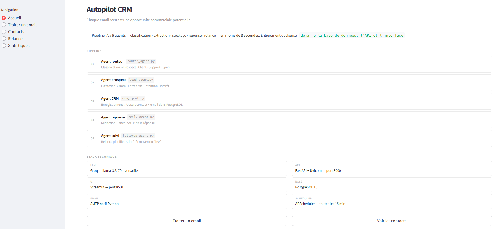
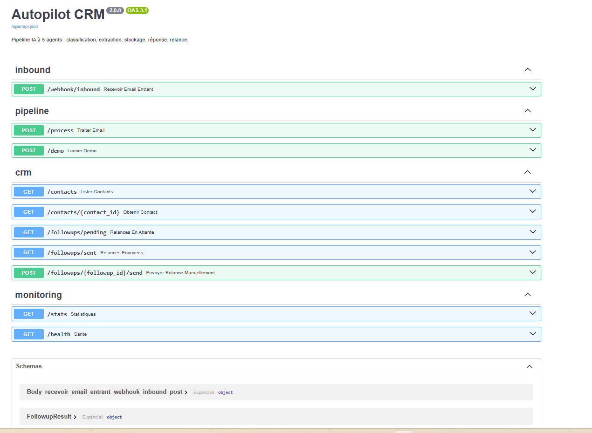
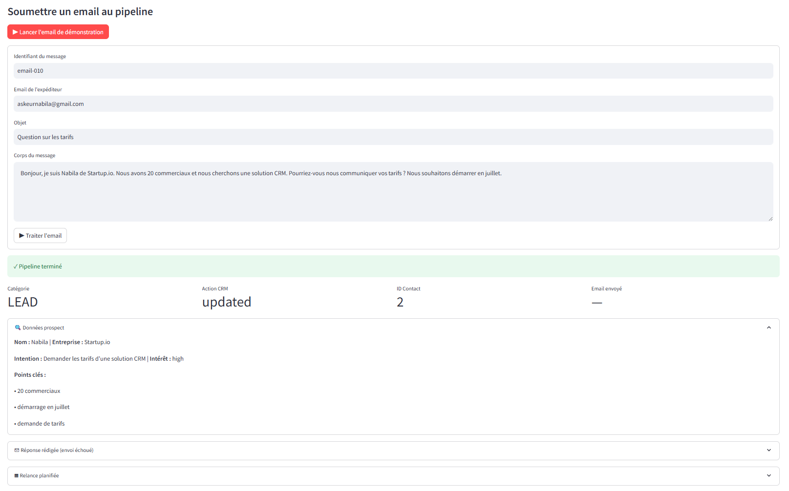
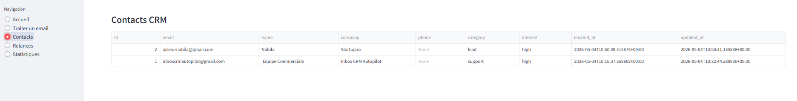
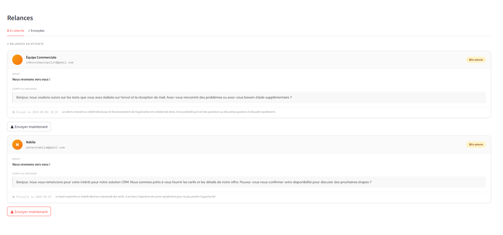
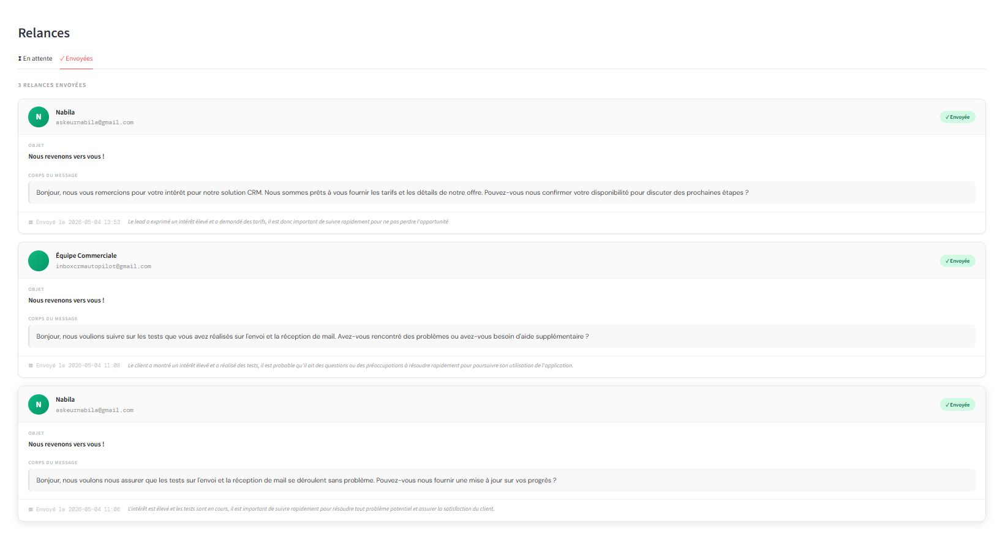
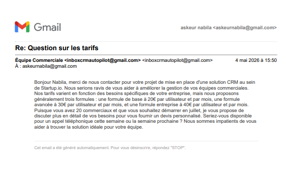
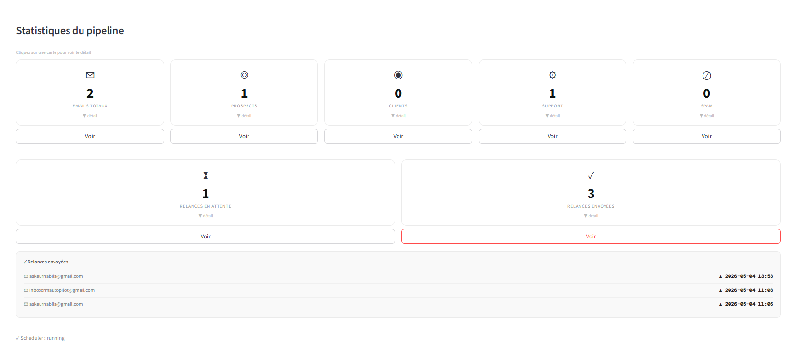

# Autopilot CRM

> Chaque email reçu est une opportunité commerciale potentielle.  
> Inbox Autopilot exécute un **pipeline IA à 5 agents** qui classe chaque email,  
> extrait les données CRM, les écrit dans votre base de données, rédige une réponse  
> et planifie un suivi — le tout en moins de 3 secondes.

---

<p align="left">
  
</p>

**Auteur :** Nabila ASKEUR  
**Stack :** FastAPI+ Uvicorn · SMTP natif Python  · APScheduler · Groq (Llama 3.3)  . PostgreSQL 16   .Streamlit · Docker 

Code source : inbox-crm-autopilot
Projet disponible sur demande
(Contact : askeurnabila@gmail.com)

## Structure du projet

```
inbox-crm-autopilot/
│
├── docker-compose.yml          ← démarre db + api + app en une seule commande
├── .env.example                ← à copier en .env et compléter avec vos clés
├── .dockerignore
│
├── db/
│   └── schema.sql              ← schéma PostgreSQL (chargé automatiquement au premier démarrage)
│
├── shared/                     ← code partagé entre api et app
│   ├── config.py               ← pydantic-settings depuis .env (Groq, SMTP, DB)
│   ├── database.py             ← moteur SQLAlchemy + session
│   └── models.py               ← tous les schémas Pydantic
│
├── api/                        ← service FastAPI  →  port 8000
│   ├── Dockerfile
│   ├── requirements.txt
│   ├── main.py                 ← tous les endpoints HTTP
│   ├── pipeline.py             ← orchestrateur des 5 agents
│   ├── agents/
│   │   ├── router_agent.py     ← classification : prospect/client/support/spam
│   │   ├── lead_agent.py       ← extraction : nom, entreprise, intention, intérêt
│   │   ├── crm_agent.py        ← upsert contact + email dans PostgreSQL
│   │   ├── reply_agent.py      ← rédaction d'une réponse email personnalisée
│   │   └── followup_agent.py   ← planification d'un suivi intelligent
│   ├── services/
│   │   ├── email_sender.py     ← envoi SMTP réel des réponses et relances
│   │   └── scheduler.py        ← tâche planifiée : envoie les relances toutes les 15 min
│   └── routers/
│       └── inbound_webhook.py  ← réception automatique d'emails via webhook Mailgun
│
└── app/                        ← interface Streamlit  →  port 8501
    ├── Dockerfile
    ├── requirements.txt
    └── main.py                 ← tableau de bord : emails, contacts, relances, statistiques
```

---

## Démarrage rapide

```bash
# 1. Configuration
cp .env.example .env
# → éditer .env et définir :
#     GROQ_API_KEY=gsk_...
#     SMTP_USER=votre@gmail.com
#     SMTP_PASSWORD=xxxx-xxxx-xxxx-xxxx   # App Password Gmail

# 2. Lancer tout
docker compose up --build

# 3. Accéder
#   Interface Streamlit  →  http://localhost:8501
#   Documentation FastAPI  →  http://localhost:8000/docs
#   PostgreSQL  →  localhost:5432  (utilisateur : autopilot / mdp : autopilot)
```

Docker démarre les services dans le bon ordre :  
**db** (sain) → **api** (sain) → **app**

---

## Endpoints de l'API

| Méthode | Endpoint | Description |
|---------|----------|-------------|
| `POST` | `/process` | Traite un email entrant via le pipeline complet |
| `POST` | `/demo` | Essai immédiat avec un email d'exemple intégré |
| `POST` | `/webhook/inbound` | Réception automatique d'emails via Mailgun |
| `GET`  | `/contacts` | Liste tous les contacts CRM |
| `GET`  | `/contacts/{id}` | Détail d'un contact + historique des emails |
| `GET`  | `/followups/pending` | Relances en attente d'envoi |
| `GET`  | `/followups/sent` | Relances déjà envoyées |
| `POST` | `/followups/{id}/send` | Force l'envoi immédiat d'une relance |
| `GET`  | `/stats` | KPIs du pipeline |
| `GET`  | `/health` | État du service + statut du scheduler |

---

### Documentation API (FastAPI / Swagger)
<p align="left">
  
</p>


## Architecture du pipeline

```
Email entrant (API /process ou webhook Mailgun)
      │
      ▼
┌─────────────┐
│Agent routeur│  → prospect / client / support / spam
└──────┬──────┘
       │ (pas spam)
       ▼
┌──────────────┐
│Agent prospect│  → nom, entreprise, intention, niveau d'intérêt
└──────┬───────┘
       │
       ▼
┌─────────────┐
│  Agent CRM  │  → upsert contact + email dans PostgreSQL
└──────┬──────┘
       │
       ▼
┌──────────────┐
│Agent réponse │  → rédaction + envoi SMTP de la réponse
└──────┬───────┘
       │
       ▼
┌─────────────┐
│Agent suivi  │  → planification de la relance en DB
└──────┬──────┘
       │
       ▼
┌──────────────────────────┐
│Scheduler (toutes 15 min) │  → envoie les relances planifiées par SMTP
└──────────────────────────┘
```

---

| # | Agent | Rôle | Fichier |
|---|-------|------|---------|
| 01 | Agent routeur | Classification → Prospect · Client · Support · Spam | `router_agent.py` |
| 02 | Agent prospect | Extraction → Nom · Entreprise · Intention · Intérêt | `lead_agent.py` |
| 03 | Agent CRM | Enregistrement → Upsert contact + email dans PostgreSQL | `crm_agent.py` |
| 04 | Agent réponse | Rédaction + envoi SMTP de la réponse | `reply_agent.py` |
| 05 | Agent suivi | Relance planifiée si intérêt moyen ou élevé | `followup_agent.py` |

---

### Agent routeur + Agent prospect — Traitement d'un email
<p align="left">
  
</p>

### Agent CRM — Contacts
<p align="left">
  
</p>

### Agent suivi + Scheduler — Relances en attente
<p align="left">
  
</p>

### Agent suivi + Scheduler — Relances envoyées
<p align="left">
  
</p>


### Agent réponse — Email reçu par le prospect
<p align="left">
  
</p>


### Statistiques du pipeline
<p align="left">
  
</p>


---

## Stack technique

| Couche      | Technologie |
|-------------|-------------|
| LLM         | Groq (llama-3.3-70b-versatile) — gratuit et rapide |
| API         | FastAPI + Uvicorn |
| UI          | Streamlit |
| DB          | PostgreSQL 16 |
| ORM         | SQLAlchemy 2 |
| Config      | Pydantic Settings |
| Email       | SMTP natif Python (Gmail, Brevo, SendGrid…) |
| Scheduler   | APScheduler — relances automatiques toutes les 15 min |
| Inbound     | Mailgun Inbound Webhook (optionnel) |

---

## Variables d'environnement

| Variable | Description | Exemple |
|----------|-------------|---------|
| `GROQ_API_KEY` | Clé API Groq | `gsk_...` |
| `GROQ_MODEL` | Modèle Groq à utiliser | `llama-3.3-70b-versatile` |
| `DATABASE_URL` | URL PostgreSQL | `postgresql://autopilot:autopilot@db:5432/crm_autopilot` |
| `SMTP_HOST` | Serveur SMTP | `smtp.gmail.com` |
| `SMTP_PORT` | Port SMTP | `587` |
| `SMTP_USER` | Adresse expéditrice | `votre@gmail.com` |
| `SMTP_PASSWORD` | App Password (sans espaces) | `abcdefghijklmnop` |
| `SMTP_FROM_NAME` | Nom affiché à l'envoi | `Équipe Commerciale` |
| `MAILGUN_WEBHOOK_KEY` | Clé de signature Mailgun (optionnel) | `key-...` |
